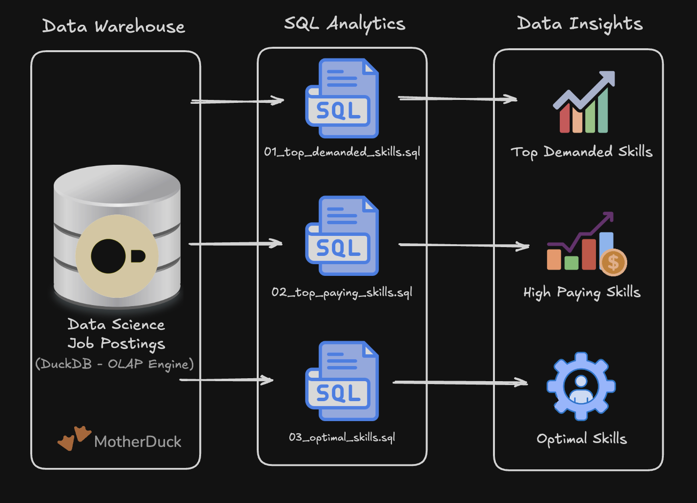

# 🔍 EXPLORATORY DATA ANALYSIS WITH SQL: JOB MARKET 



A SQL-based exploratory data analysis project analyzing the remote job market for Data Analysts and Data Engineers. The project uses job posting data to identify the **most in-demand skills, highest-paying skills, and optimal skills based on the balance between market demand and salary.**

This project demonstrates my ability to use SQL to answer real-world business questions, work with relational data models, perform analytical aggregations, and translate data into actionable career insights.

---

## 🧾 Executive Summary

### Project Scope

Built three analytical SQL queries to investigate key questions surrounding the data job market:

- 🎯 **Top Demanded Skills** – Identified the most frequently requested skills in remote Data Analyst and Data Engineer positions.
- 💰 **Top Paying Skills** – Analyzed skills associated with the highest median salaries while considering skill demand.
- ⚖️ **Optimal Skills** – Developed a combined skill score to identify skills that provide a strong balance between market demand and compensation.

### Key Findings

- 🐍 **Python and SQL** are among the most valuable foundational skills for Data Engineering.
- 🧮 **SQL** is the most demanded skill for both Data Analyst and Data Engineer positions.
- ☁️ **AWS and Azure** demonstrate strong demand across remote Data Engineering roles.
- ⚙️ **Spark, Airflow, Snowflake, and Databricks** are highly relevant technologies for modern Data Engineering.
- 💰 High salary does not necessarily mean high market value; specialized skills may have high compensation but relatively low demand.
- 📈 The optimal-skill analysis shows that **Python, Airflow, AWS, SQL, and Spark** provide strong combinations of demand and compensation.

### SQL Files

If you only have a minute, review these queries:

1. [Top Demanded Skills](01_top_demanded.skills.sql) – Analyzes the most in-demand skills.
2. [Top Paying Skills](02_top_paying_skills.sql) – Analyzes skills by median salary and demand.
3. [Optimal Skills](03_optimal_skills.sql) – Combines demand and salary into an optimal skill score.

---

# 🧩 Problem & Context

The data job market is highly competitive, and professionals need to understand which technical skills provide the greatest career value.

This project addresses three practical questions:

### 🎯 1. What skills are most in demand?

Understanding demand helps identify the technologies employers request most frequently.

### 💰 2. Which skills are associated with higher salaries?

Salary analysis provides insight into the financial value associated with specific technical skills.

### ⚖️ 3. Which skills provide the best balance between demand and salary?

A skill can command a high salary but appear in very few job postings. Conversely, a highly demanded skill may have a lower median salary.

Therefore, this project combines both dimensions to identify skills that are more practical to prioritize.

---

# 🗃️ Data Model

The analysis uses a cloud-based relational data warehouse hosted in MotherDuck and accessed through VS Code using DuckDB SQL. The model consists of a central fact table, dimension tables, and a bridge table that resolves the many-to-many relationship between job postings and skills.The warehouse structure consists of:


### Fact Table

**`job_postings_fact`**

Contains job posting information including:

- Job title
- Salary
- Remote-work status
- Job ID
- Other job attributes

### Dimension Tables
 - **`skills_dim`**
Contains information about individual technical skills.

- **`company_dim`**
Contains company information linked to job postings.


### Bridge Table

- **`skills_job_dim`**

Connects job postings to their associated skills and resolves the many-to-many relationship between jobs and skills.

The analysis joins these tables to connect job-level information with individual skill requirements.

---

# 🧰 Tech Stack

| Technology | Purpose |
|---|---|
| **MotherDuck Cloud** | Cloud data warehouse hosting the job-posting data |
| **DuckDB SQL** | Analytical SQL query execution |
| **VS Code** | SQL development environment used to connect to MotherDuck and run queries |
| **Git** | Version control |
| **GitHub** | Project documentation and repository management |

### SQL Features Used

- `INNER JOIN`
- `WHERE`
- `GROUP BY`
- `HAVING`
- `ORDER BY`
- `LIMIT`
- `COUNT()`
- `MEDIAN()`
- `ROUND()`
- `LN()`
- Boolean filtering
- Calculated metrics

---

# 📂 Repository Structure

```text
EXPLORATORY-DATA-ANALYSIS-SQL/
│
├── 01_top_demanded_skills.sql
├── 02_top_paying_skills.sql
├── 03_optimal_skills.sql
└── README.md
````

### File Descriptions

| File                         | Description                                     |
| ---------------------------- | ----------------------------------------------- |
| `01_top_demanded_skills.sql` | Identifies the most demanded skills             |
| `02_top_paying_skills.sql`   | Identifies high-paying skills and their demand  |
| `03_optimal_skills.sql`      | Calculates a combined demand/salary skill score |
| `README.md`                  | Project documentation                           |

---

# 🏗️ Analysis Overview

## 1. Top Demanded Skills

The first analysis identifies the most frequently requested skills in remote Data Analyst and Data Engineer job postings.

The query joins the job postings table with the skills bridge and skills dimension tables, filters for remote positions, groups the results by skill, and ranks them according to demand.

### Data Engineer Results

| Rank | Skill      | Demand |
| ---: | ---------- | -----: |
|    1 | SQL        | 29,221 |
|    2 | Python     | 28,776 |
|    3 | AWS        | 17,823 |
|    4 | Azure      | 14,143 |
|    5 | Spark      | 12,799 |
|    6 | Airflow    |  9,996 |
|    7 | Snowflake  |  8,639 |
|    8 | Databricks |  8,183 |
|    9 | Java       |  7,267 |
|   10 | GCP        |  6,446 |

SQL and Python clearly dominate the remote Data Engineering market, while cloud platforms and data-processing technologies form the next major skill group.

---

## 2. Top Paying Skills

The second analysis investigates the relationship between technical skills and salary.

For each skill, the query calculates:

* Number of job postings
* Median annual salary

Only skills appearing in more than 100 postings are included to reduce the influence of extremely rare skills.

### Selected Data Engineer Results

| Skill      | Demand | Median Salary |
| ---------- | -----: | ------------: |
| Rust       |    232 |      $210,000 |
| Terraform  |  3,248 |      $184,000 |
| Golang     |    912 |      $184,000 |
| Spring     |    364 |      $175,500 |
| Neo4j      |    277 |      $170,000 |
| Kubernetes |  4,202 |      $150,500 |
| Airflow    |  9,996 |      $150,000 |

### Key Insight

The highest-paying skill is not necessarily the most valuable skill to learn.

For example, Rust has the highest median salary in this analysis at approximately $210,000, but appears in only 232 postings.

In comparison, Terraform appears in 3,248 postings with a median salary of approximately $184,000.

Airflow provides another strong example, appearing in 9,996 postings with a median salary of approximately $150,000.

This demonstrates why salary should be evaluated alongside market demand.

---

# ⚖️ 3. Optimal Skills: Demand + Salary

The third analysis attempts to identify skills that provide the strongest combination of **market demand and compensation**.

Rather than allowing extremely high salaries from rare skills to dominate the analysis, the project uses a natural-log transformation of demand:

```sql
LN(COUNT(*)) * MEDIAN(jpf.salary_year_avg)
```

This creates an `optimal_skill_score` that rewards both frequent employer demand and competitive compensation.

### Top Data Engineering Skills

| Skill      | Demand | Median Salary | Optimal Score |
| ---------- | -----: | ------------: | ------------: |
| Python     | 28,776 |      $135,000 |     1,386,085 |
| Airflow    |  9,996 |      $150,000 |     1,381,491 |
| AWS        | 17,823 |      $137,320 |     1,344,125 |
| SQL        | 29,221 |      $130,000 |     1,336,744 |
| Spark      | 12,799 |      $140,000 |     1,323,997 |
| Snowflake  |  8,639 |      $135,500 |     1,228,178 |
| Databricks |  8,183 |      $132,750 |     1,196,053 |
| Java       |  7,267 |      $135,000 |     1,200,298 |
| GCP        |  6,446 |      $136,000 |     1,192,885 |

### Key Insight

Python achieves the highest optimal score because it combines extremely high demand with a strong median salary.

Airflow also ranks highly despite having lower demand than SQL and Python because of its higher median salary.

This suggests that a strong Data Engineering skill strategy should begin with foundational skills such as:

**SQL → Python → Cloud → Data Processing → Orchestration**

---

# 📊 Key Insights

### 🧠 Core Programming & Querying Skills

SQL and Python are the strongest foundational skills for Data Engineering.

SQL appears in **29,221** remote Data Engineer postings, while Python appears in **28,776**.

### ☁️ Cloud Computing

AWS and Azure demonstrate substantial demand, appearing in **17,823** and **14,143** postings respectively.

This highlights the importance of cloud infrastructure knowledge for modern Data Engineers.

### ⚙️ Data Engineering Technologies

Spark, Airflow, Snowflake, Databricks, Kafka, and Kubernetes demonstrate strong relevance across the remote Data Engineering market.

### 💰 Salary vs Demand

The analysis shows that the highest salary does not automatically indicate the best career investment.

Rare technologies can command high salaries while providing fewer job opportunities.

### ⚖️ Optimal Skill Strategy

Combining demand and salary provides a more practical framework for deciding which skills to prioritize.

---

# 💻 SQL Skills Demonstrated

## Query Design

* Multi-table `INNER JOIN` operations
* Relational data modeling
* Fact-to-dimension joins
* Many-to-many relationship handling

## Data Filtering

Used `WHERE` clauses to filter:

```sql
job_title_short
job_work_from_home
```

This ensured that the analysis focused specifically on remote Data Analyst and Data Engineer positions.

## Aggregations

Used:

```sql
COUNT()
MEDIAN()
ROUND()
```

to calculate skill demand and salary metrics.

## Grouping

Used:

```sql
GROUP BY sd.skills
```

to aggregate job postings by technical skill.

## Filtering Aggregated Data

Used:

```sql
HAVING COUNT(jpf.*) > 100
```

to focus the salary analysis on skills with sufficient market representation.

## Ranking

Used:

```sql
ORDER BY demand_count DESC
LIMIT 10
```

to identify the top demanded skills.

## Mathematical Transformations

Used:

```sql
LN(COUNT(*))
```

to apply a logarithmic transformation to demand before calculating the optimal skill score.

## Derived Metrics

Created a custom analytical metric:

```sql
optimal_skill_score =
LN(demand) × median_salary
```

This demonstrates the ability to move beyond basic SQL queries and develop metrics tailored to a specific analytical problem.

---

# 🎯 Career Takeaways

Based on the analysis, professionals targeting remote Data Engineering positions should prioritize:

### Foundation
* SQL
* Python
* Git

### Cloud
* AWS
* Azure
* GCP

### Data Processing
* Spark
* PySpark
* Kafka

### Data Platforms
* Snowflake
* Databricks
* Redshift
* BigQuery

### Orchestration & Infrastructure
* Airflow
* Docker
* Kubernetes
* Terraform

The analysis suggests that **SQL and Python provide the strongest foundation**, while cloud, orchestration, distributed processing, and infrastructure skills can provide additional specialization and market value.

---

# 📌 Conclusion

This project demonstrates how SQL can be used to answer practical questions about the technology job market.

By analyzing **skill demand, median salary, and an optimized demand/salary score**, the project moves beyond simple descriptive statistics and provides a structured approach to evaluating technical skills.

The findings indicate that the most valuable skills are not necessarily those with the highest salary or the highest demand individually. Instead, skills such as **Python, SQL, AWS, Spark, and Airflow** demonstrate a strong balance between employer demand and compensation.

---

## 👤 Author
**Emediong Inanga**

**Data Analyst | Aspiring Data Engineer**

### Core Skills

`SQL` `• Data Analytics` `• Data Engineering` `• Cloud` `• Data-Driven Insights`


